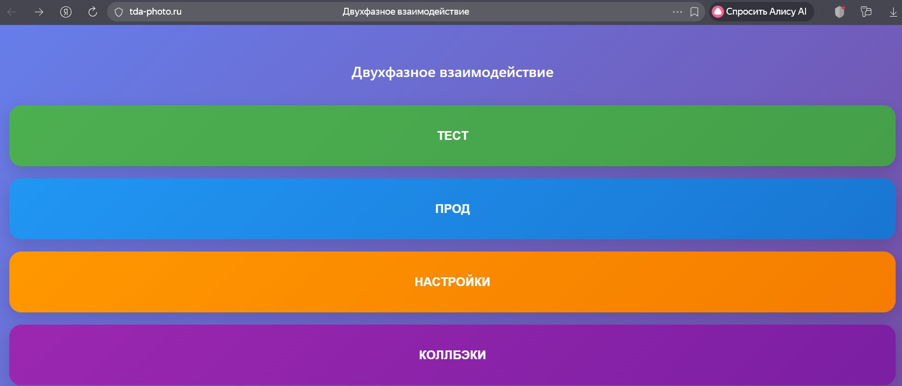

# ecom_tester

## О проекте
Автоматическое тестирование e-commerce процессов: заказы, платежи, проверки статусов.

## Технологии
- Python 3.10
- Requests, asyncio
- Postman API / тестовые скрипты

## Скриншоты

## Установка и запуск

git clone https://github.com/IOXNSUN/ecom_tester.git
cd ecom_tester
python test_runner.py
